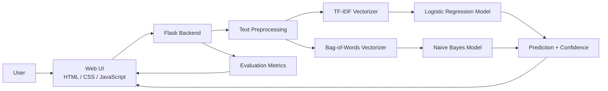
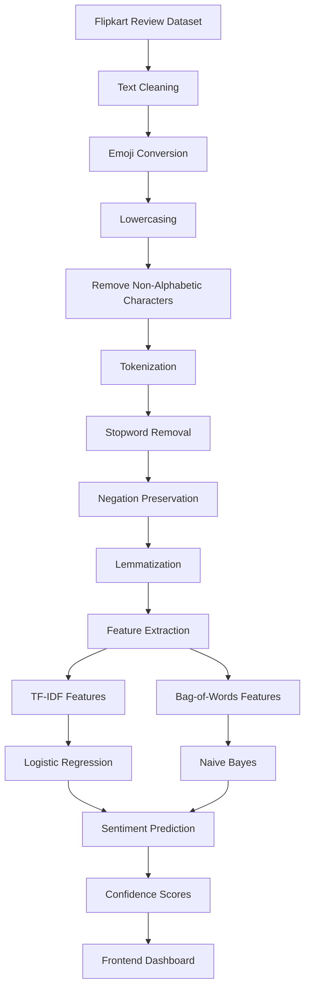
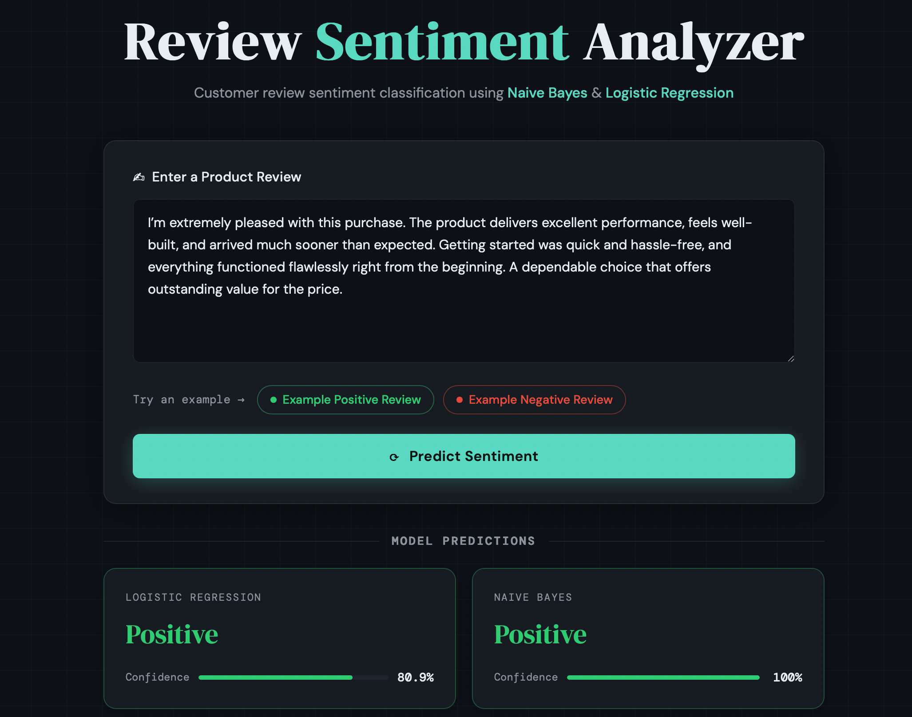
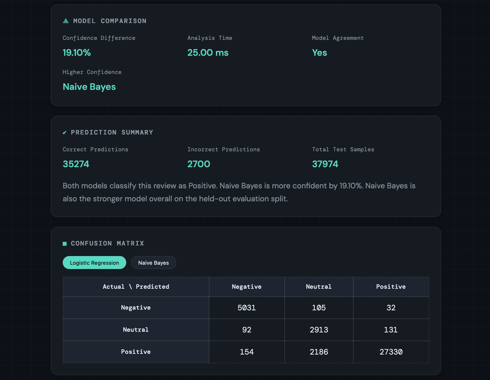
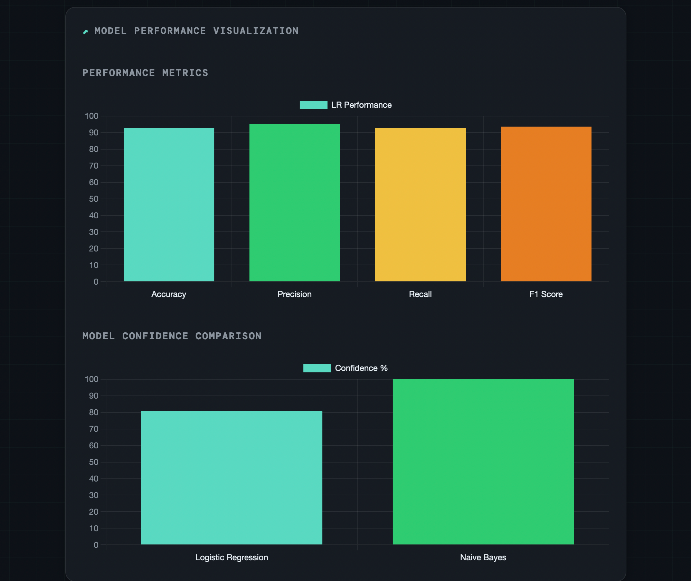

# Review Sentiment Analyzer


Review Sentiment Analyzer is a Flask-based machine learning application that performs sentiment analysis on customer product reviews and compares predictions from Logistic Regression and Multinomial Naive Bayes.

---

## Project Overview

Review Sentiment Analyzer is an end-to-end inference application for product review sentiment classification. It is designed to demonstrate a practical ML serving workflow: a user submits a review, the backend preprocesses the text, the review is vectorized using the correct feature representation for each model, and both classifiers return sentiment predictions with confidence scores.


### This project demonstrates:

- production-oriented ML inference with Flask
- consistent preprocessing between training and inference
- model packaging and artifact loading with `joblib`
- dual-model comparison for better interpretability
- REST API design for frontend-backend integration
- dashboard-style visualization of model behavior
- a maintainable Flask project structure using `templates/` and `static/`

---

## Key Features

| Feature | Description |
|---|---|
| Customer review sentiment classification | Predicts sentiment for input review text |
| Dual-model comparison | Compares Logistic Regression and Naive Bayes outputs side by side |
| Confidence score reporting | Returns model probability scores for the predicted class |
| Shared preprocessing pipeline | Keeps training and inference transformations aligned |
| Evaluation dashboard | Displays accuracy, precision, recall, F1, and confusion matrices |
| Frontend + backend integration | Browser UI communicates with Flask REST endpoints |
| Saved model artifacts | Uses pre-trained `.pkl` files for inference |
| Example inputs | Includes positive and negative example reviews for quick testing |

---

## System Architecture



---

## Machine Learning Pipeline



---

## Technology Stack

| Layer | Technologies |
|---|---|
| Backend | Python, Flask, Flask-CORS |
| ML / NLP | scikit-learn, NLTK, emoji, joblib |
| Frontend | HTML, CSS, JavaScript, Chart.js |
| Data | CSV dataset, saved model artifacts |
| Visualization | Chart.js bar charts, confusion matrix table |

---

## Repository Structure

```text
Review-Sentiment-Analyzer/
├── app.py
├── requirements.txt
├── README.md
├── .gitignore
├── FMiniProject.ipynb
├── Flipkart_Product.csv
├── model_lr.pkl
├── model_nb.pkl
├── tfidf.pkl
├── bow.pkl
├── classes.pkl
├── templates/
│   └── index.html
└── static/
    ├── style.css
    └── script.js
```

### Structure notes

- `templates/` contains the Flask HTML template.
- `static/` contains the CSS and JavaScript assets.
- The notebook is included to document the training and experimentation workflow.

---

## Model Comparison Approach

The application intentionally uses two classical text classification models to compare behavior on the same input.

| Model | Vectorizer | Why it fits |
|---|---|---|
| Logistic Regression | TF-IDF | Strong baseline for sparse text features and linear decision boundaries |
| Naive Bayes | Bag-of-Words | Fast probabilistic baseline that performs well on text classification tasks |


### Why the project uses two vectorizers

Each model is paired with the representation it was trained on:

- Logistic Regression uses TF-IDF
- Naive Bayes uses Bag-of-Words

This avoids feature mismatch and keeps inference behavior consistent with training.

---

## How It Works

1. The user submits a product review.
2. The backend preprocesses the text:
   - emoji conversion
   - lowercasing
   - non-alphabetic character removal
   - tokenization
   - stopword removal
   - negation preservation
   - lemmatization
3. The cleaned text is vectorized:
   - TF-IDF for Logistic Regression
   - Bag-of-Words for Naive Bayes
4. Both models generate predictions.
5. Confidence scores are returned.
6. Evaluation metrics are displayed in the UI.

---

## Machine Learning Pipeline Design

| Stage | Implementation Detail |
|---|---|
| Input normalization | Review text is cleaned before inference |
| Emoji handling | Emojis are converted into text tokens |
| Negation handling | Words such as `not`, `no`, and `never` are preserved |
| Feature extraction | TF-IDF and Bag-of-Words are used for the two models |
| Inference | Both models predict independently on the same input |
| Evaluation | Metrics are computed on a held-out test split |

---


## Installation & Setup

### Prerequisites

- Python installed locally
- `pip`
- A terminal with access to the project directory

### Install dependencies

```bash
git clone https://github.com/arshsolkar5/Review-Sentiment-Analyzer.git
cd Review-Sentiment-Analyzer
python -m venv .venv
source .venv/bin/activate
pip install -r requirements.txt
```

### Notes

- On Windows, activate the environment with:

```bash
.venv\Scripts\activate
```


---

## Running Locally

Start the application with:

```bash
python app.py
```

Then open the app in your browser:

```text
http://127.0.0.1:5000
```

If the app is starting for the first time, it may take slightly longer because it loads the trained artifacts and builds the evaluation metrics from the dataset.

---


## Screenshots


### Dashboard


### Prediction Results


### Performance Visualization



---

## Future Improvements

| Area | Planned Improvement |
|---|---|
| Modeling | Add transformer-based sentiment classifiers |
| Packaging | Containerize the application with Docker |
| Delivery | Add CI/CD for automated testing and deployment |
| Monitoring | Track inference behavior and data drift |
| Deployment | Deploy to a cloud platform such as Render, Railway, or Hugging Face Spaces |
| Security | Add user authentication for managed access |
| Observability | Add structured logs and model health checks |

---

## Learning Outcomes

This project demonstrates practical experience in:

- building an NLP inference pipeline
- preparing text data for machine learning
- using classical ML models for sentiment analysis
- serving models through a Flask application
- exposing REST API endpoints for frontend consumption
- packaging trained artifacts for reuse
- designing a dashboard that makes ML outputs easier to interpret

---

## Author

**Arsh Solkar**

